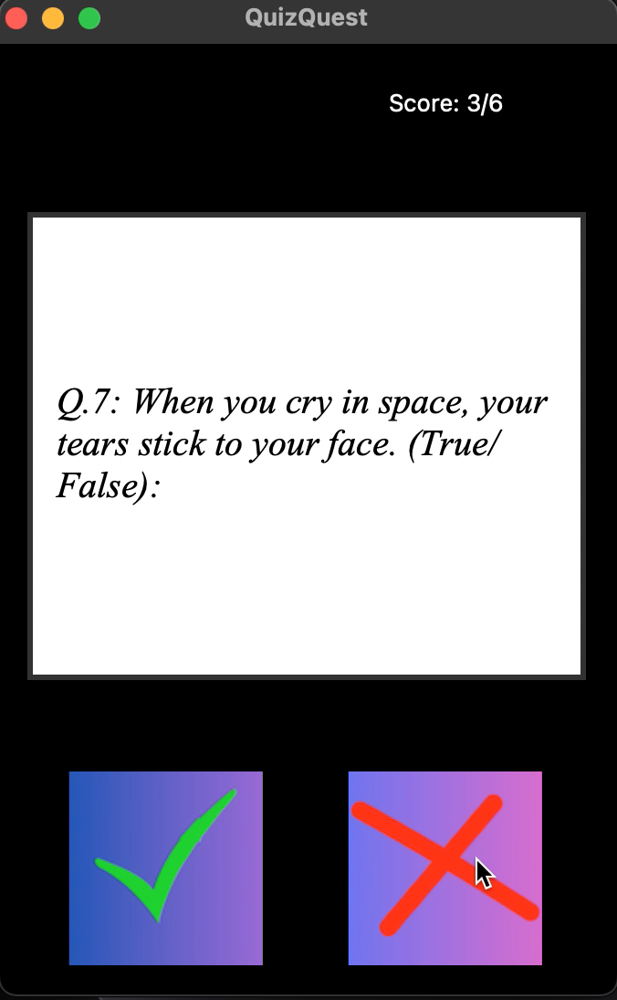
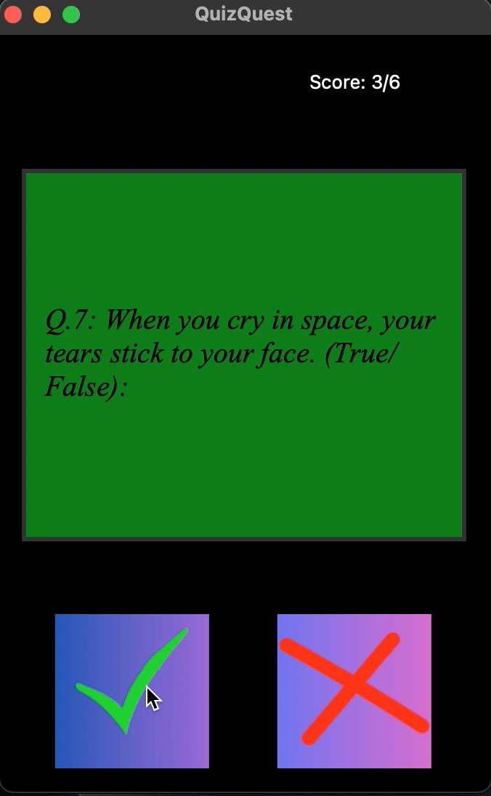
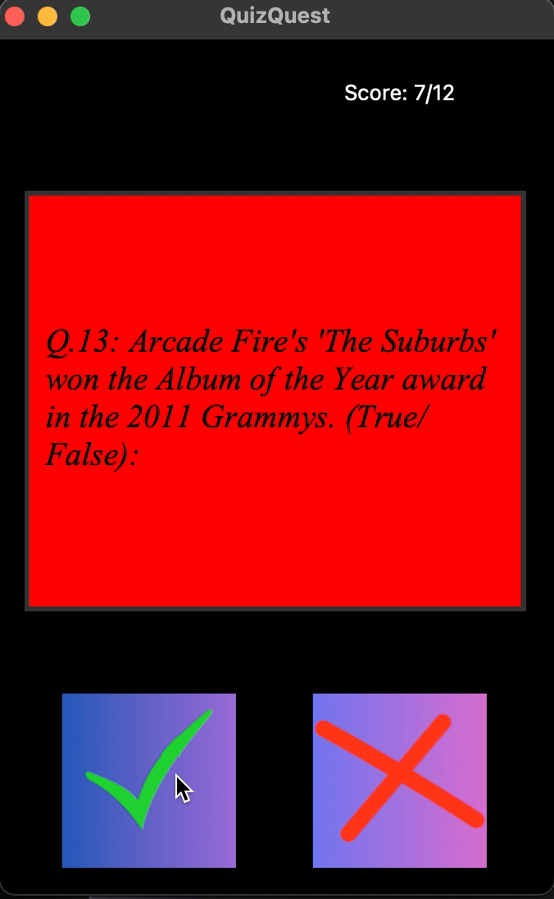

# Quizzler - A Fun Trivia Quiz Game 🧠🎉

## 📌 Project Overview
Quizzler is an interactive quiz game built using **Python** and **Tkinter**, designed to test and improve your knowledge across various topics. The game fetches questions from a quiz database, displays them on the UI, and allows players to answer **True** or **False**.

## 🚀 Features
- 🔹 **Dynamic Question Fetching** – Retrieves questions dynamically from the `QuizBrain` module.
- 🔹 **User-Friendly Interface** – Simple and engaging GUI using **Tkinter**.
- 🔹 **Score Tracking** – Keeps track of the user's score in real time.
- 🔹 **Visual Feedback** – Background changes based on correct or incorrect answers.
- 🔹 **Game Completion Message** – Disables buttons when the quiz is completed.

## 🛠️ Technologies Used
- **Python** 🐍
- **Tkinter** (for GUI)
- **OOP (Object-Oriented Programming)**

- ## ⚡ API USED
 [https://opentdb.com/api.php](https://opentdb.com/api.php) 

  
## 🎮 How to Play
1. Run the `main.py` file.
2. Read the displayed question.
3. Click the ✅ **True** or ❌ **False** button to answer.
4. The background will change color based on your answer:
   - ✅ **Green** for Correct
   - ❌ **Red** for Incorrect
5. Score updates automatically.
6. The game ends when all questions are answered.

## Project Preview 🚀
Here’s how the project looks while running:  
The question being asked:






## 📂 Project Structure
```
📦 Quiz Game
├── 📜 main.py             # Entry point of the game
├── 📜 data.py             # Fetches the data from API
├── 📜 ui.py               # Handles UI components
├── 📜 question_model.py   # Has the structure of the question
├── 📜 quiz_brain.py       # Logic for fetching and checking answers
├── 📂 images/             # Stores True/False button images
└── 📜 README.md           # Project documentation
```

## API handling
you can go through the API and change the parameters according to your needs.
 ```bash
   url= "https://opentdb.com/api.php"

   parameters = {
       "amount": 15,
       "type": "boolean"
   }
   ```


## ⚡ Installation & Setup
1. Clone the repository:
   ```bash
   git clone https://github.com/yourusername/quiz-game.git
   cd quiz-game
   ```
2. Install dependencies (if required):
   ```bash
   pip install tkinter
   ```
3. Run the game:
   ```bash
   python main.py
   ```

## 🎯 To-Do / Future Enhancements
- 🌟 Add more question categories.
- 🌟 Integrate an API for real-time questions.
- 🌟 Implement a leaderboard system.

## 💡 Contributing
Contributions are welcome! Feel free to open an issue or submit a pull request.

---

🚀 **Enjoy playing Quizzler and test your knowledge!**

